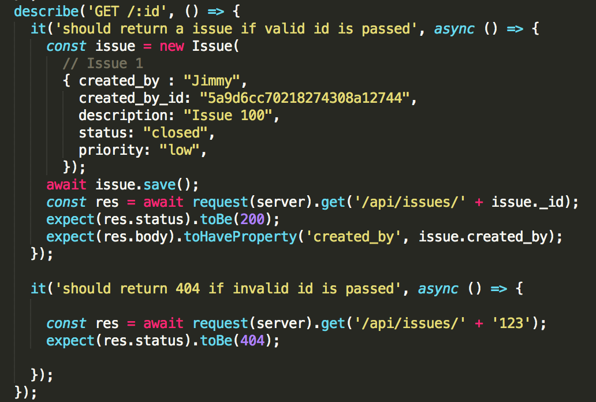
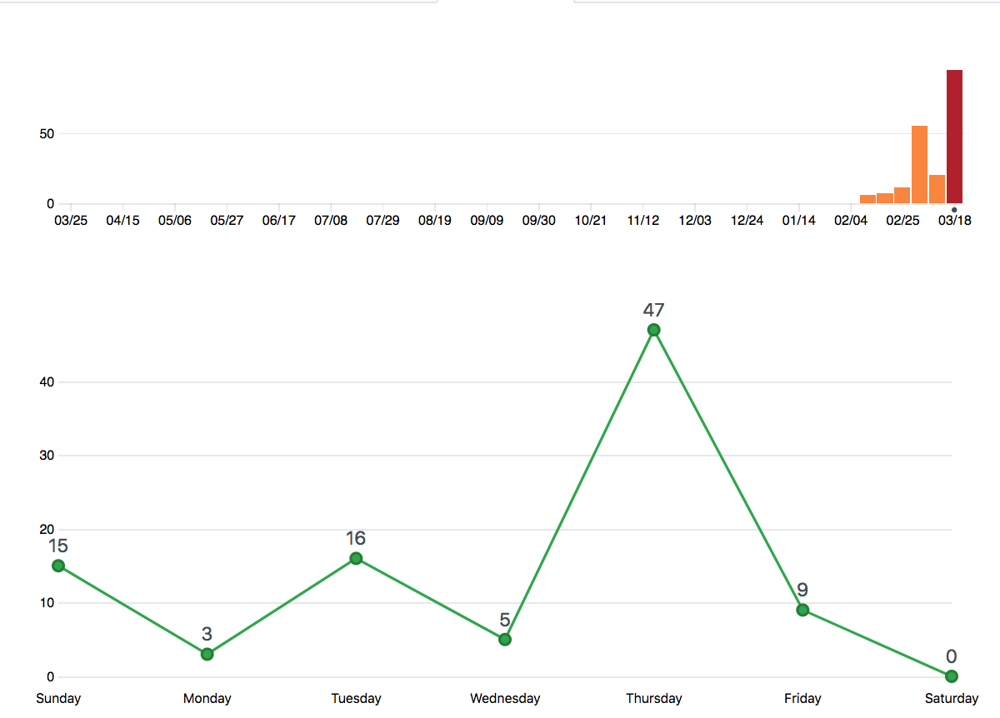

**1. What did you actually build during this phase?**

 **1.1 Summary of core features**

​	The purpose of this website was to build a graduation admission ticketing system to allow the department to organize the selection and admission of students and easy accessible ticketing panels to allow managing the admission process. For this, we have divided the big system into a subsystem with some of the core features that makes up part of the big ticketing system. In this phase, we have developed the cores features such as user authentication, basic ticketing system for student, budget director, professors, associate chair graduate, grad office staff, a dashboard for viewing ticket status. We also have additional features such as editing notes for tickets and dashboard notifications. 

**1.2 Features that were implemented**

**Authentication:**

​	User is able to create an unique account and login with the credentials. 

​	User is able to register for four different types of account.

​	Sign up: Client-side: Register form, basic client-side validation of password lengths and email address format. Server-side: User credentials are sent to database (mongo database). 

​	Login: User enters the credentials and system validates the user using by sending data to the backend and looking up in the database.

**User session**

​	Using redux and local storage to implement a user session. 

**Ticketing system**	

​	**Student**: View ticket status in the ticket page

​	**Budget Director**: 

​		Create tickets to be issued for any user

​		Status page to see total amount of tickets created for that year; see amount of tickets allocated to any user.

​		Status page to see how many tickets are granted to international vs domestic students

​		Ability to mark ticket as granted

​	**Professors (Faculty)**:

​		Professors can view potential applicants and keeps track of ratio of domestic and international applicants on status page

​		Professors can check the status of each ticket as offer granted, offer request, offer pending, offer refused and offer accepted.

​		Faculty can associate ticket to an applicant which will change the state of ticket to offer-request

​	**Grad office staff**

​		See the status of all tickets, and be able to edit the ticket state

​		Accept or refuse tickets that have been granted

​	**Dashboard / overview**

​		Track total tickets & ticket states

​		Track ratio of international vs. domestic tickets

​		Add / delete tickets

​	**Testing**

​		Testing was done for issues page, in order to test the API (GET and POST)

​	**Database**

​		Used MongoDB to implement the database for storing users, issue, notes, offer and tickets (schemas). 

​		link to the database schemas: 

​		https://github.com/csc302-winter-2018/proj-BrokenDream/tree/master/app/node_be/models	

We haven't fully implemented the front-end using those backend features. 

**2. How is this different from what you originally proposed?Why?**

We have implement all of the proposed features for the backend, however, we haven't make them appear in the front-end since we are running out of time. 

**3. Architectural & component-level design (High level description of the software design)**  

**3.1 Technologies and tools**

​	The technologies used in this phase were: 

​	**Front-end:** HTML, CSS, Javascript, React, BootStrap, Semantic UI.

​	These technologies were used to display the page layouts and design of tickets system, such as forms, menus, tickets display, offers, etc. 

​	**Backend:** Node, Express, Javascript

These server-side technologies were used to send and store data client-side input to data or updates in page components such as sending sign up and login form, editing tickets to the server, in order to keep permanent and consistent data. 

​	**Database:** MongoDB

We have chosen MongoDb as database tool, since it provides a faster data storages for web applications that communicate extensively with the data backend. We used this tool to store data such as user credentials (register), tickets information, offers information and issue information. 

We have selected those tool because they provide portability and can be integrated and operate well on all platforms. 

**3.3. Screen shot breakdown**

​	**User** 

​	dashboard.js - what user would see when first entering the website. 

​	LoginUser.js - what user would see when submitting a login form

​	DisplayTicket.js - what user would see when viewing ticket page and status of their ticket.

​	UserInfo.js - Display user information

​	DisplayIssue.js - what user would see when generating a ticket.

​	DisplayOffer.js - User is able to see the status of the offer.

**3.4 Database architecture**

* **Database description**

​	We used MongoDB for maintaining the database for storing user data, ticket information, issues information, offers information, form and other pages dynamic objects. 

*  **Data Access Layer**

  The database will be accessible to all users, administrators, and automated services.
  A login will determine what parts of the database can be accessed and changed.

**3.5 API**

​	**3.6.1 API description**

​	[swagger link](https://app.swaggerhub.com/apis/csc302BD/GradApp/1.0.0)

**3.7 Description of non functional attributes**

* **Reliability:** We ensured that the system is reliable in user data fetching (data that is requested by the user is always correct) and update any user event in interaction with the data by consistently updating the database. The website is stable and handles error by displaying error message to the user. 
* **Maintainability:** We ensured maintainability by separating modules for each for each of the functionality, separate each page in different javascript file, and a generic database models that can be easily updated. We made sure that each part of the application can be updated or changed and carried out without affecting the application as a whole.
* **Reusability:** We ensured reusability of code by well designing frameworks and customized components, so that when we make changes, we don't need to copy paste the codes everywhere again. For example, since we had same components such as forms, menus and boxes, we developed a template for each of them and reused the codes.
* **Security:** We ensured that a user is verified with credentials using login and authenticates the user, before any personal data is accessed by the user. However, we should protect the client-side attack such as code injection in next phase. 

**5. Testing issues**	

Test cases and Expected results

Test cases were created for evaluate the correcteness of API for Issues page. The test cases were set up by creating random data and call GET and POST methods using those data. Examples of test cases were: testing GET method by returning all issues, return an issue if valid id is passed, error otherwise, and also save issue in database if user is signed in. 

The following artifact is an example of how we tested the API and error handling:

Link to source code: https://github.com/csc302-winter-2018/proj-BrokenDream/blob/master/app/node_be/test/integration/issues.test.js

**6. Technical highlights: interesting bugs, challenges, lessons learned, observations, etc.**

* Interesting bugs: Front-end components weren't showing up.
* Challenges: We didn't expect to use the language such as React since it is new to most of us. However, we found out that React might be the best tool to give a good user experience and design. As a result, we were learning a new language during the development, which is quite challenging. 
* Lessons learned: We learned new technologies such as React and redux. 

**7. Project management and progress reporting**

1.   **Teamwork and project progress (with burndown chart)**

     Teamwork progress description: 

     - The artifact below is the project progress chart and the meetings minutes. 

       - **Burndown chart of github commits**

       

       ​

       - **Progress table and meetings minutes**

         | Dates     | Meetings description                     | minutes             |
         | --------- | ---------------------------------------- | ------------------- |
         | Feb 23    | Plan meeting: Talked about the project. Discussed about the APIs of the backend. Set up group repo. | 60, tutorial        |
         | March 2nd | Gathered the work and continued discussing work on APIs for ticket page. Discussed on the components of each of pages in front-end and made draft designs. | 60, tutorial        |
         | March 9   | Plan meeting: Discussed about the database implementation and the schemas attributes in the database. | 60, tutorial        |
         | March 16  | Discussed about the use of the middlewares and the use of auth. | 60, tutorial        |
         | March 21  | Combined the project for front and back end. Debugged codes. Separate tasks. | 60, offline meeting |
         | March 22  | Gather final work. Prepare for the demo. | 60, offline meeting |

2. **Things that worked well (strengths)**

   The separation of independent in front end and back end worked very well. By dividing front end and back end, we were able to work on independent tasks without having to worry about the merge conflicts.  Whenever an integration of front and back end is needed, we made sure to communicate with each other in order to decide and make plans for parts that might cause conflicts. This division gave us a significant efficiency in the code development phases. Also, in the code development process, we made sure to separate modules as small as possible so that we could reuse each other's code, and it made the code easier to understand and to debug. In order to better manage the project, we made a list of features to be implemented and kept tracked of the features that were implemented. This allowed each member to keep up to date what is done and this allowed us to better manage our time and making coding decisions based on accomplished tasks. For example, if someone is working on database and saw that the front end form is accomplished, then he can look at the form to design the user schema model for the storing the data from the form.

3. **Improvements (weakness) Next phase goals (phase 3 final demo)**

   Communication between members was a weaker part, for example, there were lack of exchanging ideas of how to design, make decisions on planning what features to be implemented and how they should be implemented. Also, when members miss the meetings, it was hard to keep up with the progress. As a result, in phase 3, we should communicate with each other by having more offline and online meetings in which we will discuss about the each other's progress and update on tasks to be completed for the next meeting. Another weakness would be lack of planning and keep up with deadlines. For next phase, we will make sure to make plans for making things by deciding upon deadlines for specific tasks to be done. To do so, we will make a group calendar during the meeting and write down the dates and tasks. 

**8. Phase 3 goals (final demo)**

Plan for final work towards demo

* **Make the website fully functional:** We haven't finished all of the proposed features. We will implement all of the features and make the website fully functional for the next phase. 

- **Enhance security:** From the above standards of the website, we haven't yet satisfy the security standard. We will solidify the security of the website. In particular, we will develop ways to prevent code injection from client-side. 
- **Deploy the project:** We will deploy the project in order to make the system accessible anytime, anywhere and thus enhance the portability. In particular, we will use Heroku as tool.
- **Test the implementation:** We will use continous integrating testing to test our implementation. In particular, we will test the APIs too see if data is correctly sent. 
- **Add additional features**: We will add more features.

